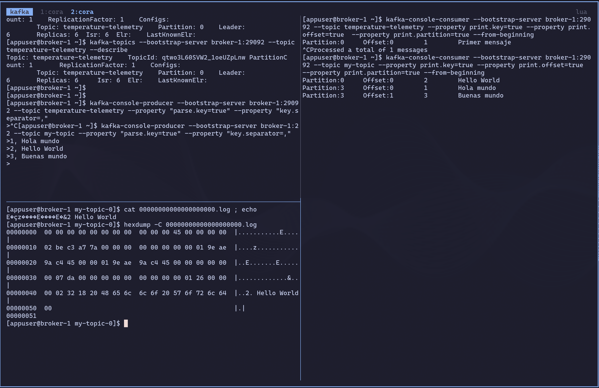
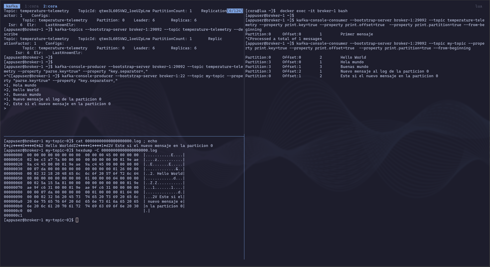

# CLI (Command Line Interface)

## Objetivo

Asimilar los conceptos mediante el uso de distintas herramientas de consola disponibles por defecto en cualquier distribución **Kafka**

Ver: [Kafka Command-Line Interface (CLI) Tools](https://docs.confluent.io/kafka/operations-tools/kafka-tools.html#)

## Práctica

Lo primero que tenemos que hacer es habilitar una **consola interactiva** dentro de uno de los contenedores brokers de nuestro cluster

```bash
docker exec -it broker-1 /bin/bash
```

## Admin API

### kafka-configs

El comando **kafka-configs** permite cambiar la configuración de los brokers y los topics de un cluster

[Kafka Broker-Level Config](http://kafka.apache.org/10/documentation.html#brokerconfigs)

[Kafka Topic-Level Configs](http://kafka.apache.org/10/documentation.html#topicconfigs)

#### Lista propiedades de configuración a nivel de cluster

```bash
kafka-configs --bootstrap-server broker-1:29092 --entity-type brokers --describe --all
```

#### Cambiar propiedades de configuración a nivel de cluster

En este caso, vamos a cambiar el tamaño máximo de los segmentos (log.segment.bytes):

```bash
kafka-configs --bootstrap-server broker-1:29092 --entity-type brokers --entity-default --alter --add-config log.segment.bytes=10485760
```

Verifica que se ha cambiado

```bash
kafka-configs --bootstrap-server broker-1:29092 --entity-type brokers --describe --all | grep log.segment.bytes
```

Restauramos la configuración previa

```bash
kafka-configs --bootstrap-server broker-1:29092 --entity-type brokers --entity-default --alter --add-config log.segment.bytes=1073741824
```

El tamaño por defecto de log.segment.bytes es de `1073741824 = 1GiB`, el tiempo máximo antes de rotar a un nuevo segmento es de log.roll.hours `168horas = 7días`.

### kafka-topics

El comando **kafka-topics** permite crear y administrar los topics de un cluster.

#### Listar todos los topics

```bash
kafka-topics --bootstrap-server broker-1:29092 --list
```

#### Creación de un topic

En este caso, vamos a crear un topic llamado **my-topic** con 4 particiones, factor de replicación 2 y personalizando un par de propiedades (message.max.bytes y flush.messages=1)

> **NOTA**:
>
> **flush.messages [(Ver doc):](https://docs.confluent.io/platform/current/installation/configuration/topic-configs.html#flush-messages)** Fuerza la escritura en disco al log después de cada mensaje.

```bash
kafka-topics --bootstrap-server broker-1:29092 --create --topic my-topic --partitions 4 --replication-factor 2 --config max.message.bytes=64000 --config flush.messages=1
```

#### Describir un topic

```bash
kafka-topics --bootstrap-server broker-1:29092 --topic my-topic --describe
```

#### Modificación de configuración de un topic

```bash
kafka-configs --bootstrap-server broker-1:29092 --entity-type topics --entity-name my-topic --alter --add-config max.message.bytes=128000
```

#### Modificación del número de particiones de un topic

```bash
kafka-topics --bootstrap-server broker-1:29092 --alter --topic my-topic --partitions 6
```

#### Borrar un topic

```bash
kafka-topics --bootstrap-server broker-1:29092 --delete --topic my-topic
```

### Control Center

Trata de explorar la interfaz web de Control Center para hacer realizar operaciones anteriores

## Producer / Consumer API

### kafka-console-producer

El comando **kafka-console-producer** nos permite producir datos en un topic.

#### Producir datos en un topic

Primero crearemos un topic **temperature-telemetry** con 3 particiones y factor de réplica 3.

```bash
kafka-topics --bootstrap-server broker-1:29092 --create --topic temperature-telemetry --partitions 3 --replication-factor 3 --config flush.messages=1
```

Lo siguiente ejecutar el comando para producir

```bash
kafka-console-producer --bootstrap-server broker-1:29092 --topic temperature-telemetry --property "parse.key=true" --property "key.separator=,"
```

Este comando es interactivo, y producirá un mensaje por cada línea que escribamos

Los mensajes a producir seguirán el siguiente formato: **key**,**value**

Es decir lo que va antes de la coma es la clave (key) y lo que va después es el valor (value). En este caso el value de nuestros mensajes es un objeto JSON

```json
1,{"id": 1, "temperature": 15}
2,{"id": 2, "temperature": 20}
1,{"id": 1, "temperature": 16}
3,{"id": 3, "temperature": 18}
4,{"id": 4, "temperature": 18}
5,{"id": 5, "temperature": 17}
4,{"id": 4, "temperature": 21}
```

Copia de una en una cada línea, pégala en la consola interactiva del producer y pulsa intro

### kafka-console-consumer

El comando **kafka-console-consumer** nos permite consumir datos en un topic.

#### Consumir datos en un topic

Ahora crearemos un consumidor de consola para consumir los datos

```bash
kafka-console-consumer --bootstrap-server broker-1:29092 --topic temperature-telemetry --property print.key=true --from-beginning
```

¿Qué pasa cuando este arranca?

<details>
  <summary><b>Solución</b></summary>

¡El consumidor consume todos los mensajes!.
</details>

¿Que pasara si añadimos otro consumidor?

<details>
  <summary><b>Solución</b></summary>

¡Tenemos dos consumidores consumiendo exactamente los mismos mensajes!.
</details>

#### Consumir datos en un topic con un grupo de consumo

Ahora consumiremos con dos consumidores formando un único grupo de consumo (**console-group**):

```bash
kafka-console-consumer --bootstrap-server broker-1:29092 --topic temperature-telemetry --property print.key=true --group console-group
```

Observad el rebalanceo y particionado que se produce mediante la partition key elegida.

> ❗️ **NOTA**<br/>Para detener una aplicación de consola debemos pulsar **Ctrl+C**


#### Inspeccionar los log en disco

Inspecionamos como los `.log` de la **partición-0**, para ver como Kafka escribe los mensajes en disco, en este caso serializados como string.



LLega el segundo mensaje.



¿Qúe escribe Kafka en los `.log`? Descripción de un registro:

```
baseOffset del batch
--------------------
00 00 00 00 00 00 00 00
=> baseOffset = 0


record
------
26        record length
          varint = 0x26 = 38 decimal
          ZigZag decode:
            (38 >>> 1) ^ -(38 & 1)
            19 ^ 0
            19
          => 19 bytes

00        attributes
          byte normal, no ZigZag
          => 0

00        timestamp delta
          varlong ZigZag
          varint = 0x00 = 0 decimal
          ZigZag decode:
            (0 >>> 1) ^ -(0 & 1)
            0 ^ 0
            0
          => timestampDelta = 0

00        offset delta
          varint ZigZag
          varint = 0x00 = 0 decimal
          ZigZag decode:
            (0 >>> 1) ^ -(0 & 1)
            0 ^ 0
            0
          => offsetDelta = 0

          offset absoluto:
            baseOffset + offsetDelta
            0 + 0
            0

          => offset absoluto del mensaje = 0

02        key length
          varint ZigZag
          varint = 0x02 = 2 decimal
          ZigZag decode:
            (2 >>> 1) ^ -(2 & 1)
            1 ^ 0
            1
          => key length = 1 byte

32        key
          ASCII 0x32 = "2"
          => key = "2"

18        value length
          varint ZigZag
          varint = 0x18 = 24 decimal
          ZigZag decode:
            (24 >>> 1) ^ -(24 & 1)
            12 ^ 0
            12
          => value length = 12 bytes

20 48 65 6c 6c 6f 20 57 6f 72 6c 64
          value
          ASCII:
            20 = espacio
            48 = H
            65 = e
            6c = l
            6c = l
            6f = o
            20 = espacio
            57 = W
            6f = o
            72 = r
            6c = l
            64 = d
          => value = " Hello World"

00        headers count
          varint
          => 0 headers
```

```
baseOffset del batch
--------------------
00 00 00 00 00 00 00 01
=> baseOffset = 1


record
------
64        record length
          varint = 0x64 = 100 decimal
          ZigZag decode:
            (100 >>> 1) ^ -(100 & 1)
            50 ^ 0
            50
          => 50 bytes

00        attributes
          byte normal, no ZigZag
          => 0

00        timestamp delta
          varlong ZigZag
          varint = 0x00 = 0 decimal
          ZigZag decode:
            (0 >>> 1) ^ -(0 & 1)
            0 ^ 0
            0
          => timestampDelta = 0

00        offset delta
          varint ZigZag
          varint = 0x00 = 0 decimal
          ZigZag decode:
            (0 >>> 1) ^ -(0 & 1)
            0 ^ 0
            0
          => offsetDelta = 0

          offset absoluto:
            baseOffset + offsetDelta
            1 + 0
            1

          => offset absoluto del mensaje = 1

02        key length
          varint ZigZag
          varint = 0x02 = 2 decimal
          ZigZag decode:
            (2 >>> 1) ^ -(2 & 1)
            1 ^ 0
            1
          => key length = 1 byte

32        key
          ASCII 0x32 = "2"
          => key = "2"

56        value length
          varint ZigZag
          varint = 0x56 = 86 decimal
          ZigZag decode:
            (86 >>> 1) ^ -(86 & 1)
            43 ^ 0
            43
          => value length = 43 bytes

20 45 73 74 65 20 73 69 20 65 6c 20 6e 75 65 76
6f 20 6d 65 6e 73 61 6a 65 20 65 6e 20 6c 61 20
70 61 72 74 69 63 69 6f 6e 20 30
          value
          ASCII:
            20 = espacio
            45 = E
            73 = s
            74 = t
            65 = e
            20 = espacio
            73 = s
            69 = i
            20 = espacio
            65 = e
            6c = l
            20 = espacio
            6e = n
            75 = u
            65 = e
            76 = v
            6f = o
            20 = espacio
            6d = m
            65 = e
            6e = n
            73 = s
            61 = a
            6a = j
            65 = e
            20 = espacio
            65 = e
            6e = n
            20 = espacio
            6c = l
            61 = a
            20 = espacio
            70 = p
            61 = a
            72 = r
            74 = t
            69 = i
            63 = c
            69 = i
            6f = o
            6e = n
            20 = espacio
            30 = 0
          => value = " Este si el nuevo mensaje en la particion 0"

00        headers count
          varint
          => 0 headers
```