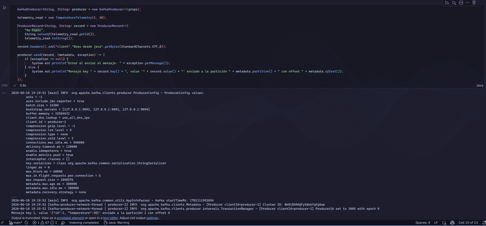
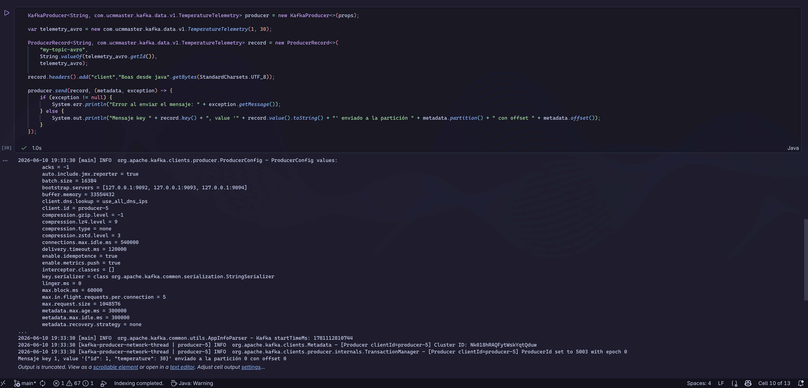
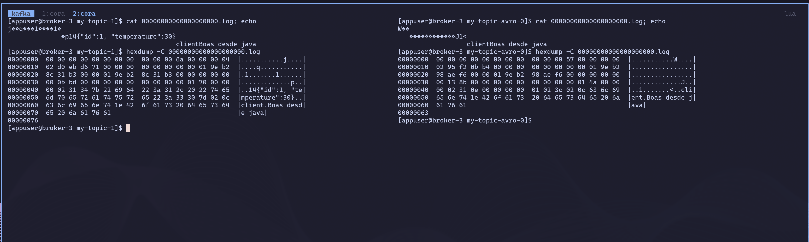

# JAVA

## Objetivo

Asimilar los conceptos mediante el uso del lenguaje java ☕️

## Build

Para construir el proyecto usaremos **maven**.

Podemos usar nuestro IDE de referencia o la línea de comando.

```bash
mvn clean install
```

## Simple Client

### Producer API

Las clases relativas a la producción son **Producer** y **ProducerApp**

Del mismo modo, para ejecutar la aplicación productora podemos usar nuestro IDE o la linea de comandos

```bash
mvn dependency:copy-dependencies
```

```bash
java -Djava.security.manager=allow -cp "target/classes:target/dependency/*" com.ucmmaster.kafka.simple.ProducerApp
```

Deberías empezar a ver logs en la pantalla

### Consumer API

Las clases relativas a la producción son **Consumer** y **ConsumerApp**

En este caso abre una nueva terminal para poder tener ejecutando a la vez productor y consumidor

```bash
java -Djava.security.manager=allow -cp "target/classes:target/dependency/*" com.ucmmaster.kafka.simple.ConsumerApp
```

Deberías empezar a ver logs en la pantalla

ConsumerApp crea una aplicación consumidora con 2 consumers.

Fíjate en los logs, que los threads **[Thread-0]** y **[Thread-1]** están consumiendo topics de sus respectivas particiones

Si ejecutas la aplicación consumidora desde el IDE, es posible matar unos de estos threads, y por lo tanto podremos ver el rebalanceo de las particiones de ese consumidor al otro

> ❗️ **NOTA**<br/>Para detener una aplicación de consola debemos pulsar **Ctrl+C**

> 📚 **NOTA**<br/>La configuración tanto del productor como del consumidor están externalizadas en el fichero **simple-client.properties**

> 💊 **NOTA**<br/>Lee el código de todas las clases<br/>Analiza las clases de [Producer](https://kafka.apache.org/39/javadoc/index.html?org/apache/kafka/clients/producer/KafkaProducer.html) y [Consumer](https://kafka.apache.org/39/javadoc/index.html?org/apache/kafka/clients/consumer/KafkaConsumer.html) API <br/> Trata de hacer pequeñas modificaciones

## Avro Client

En este ejemplo, vamos a hacer lo mismo pero esta vez haciendo uso de un **data contract** expresado con un esquema AVRO.

### Data Contract

El contrato de datos se encuentra definido en com.ucmmaster.kafka.data.v1.TemperatureTelemetry.avsc

La generación de la correspondiente clase TemperatureTelemetry.java se hace a través de un plugin maven.

### Producer API

Las clases relativas a la producción son **Producer** y **ProducerAvroApp** dentro del paquete com.ucmmaster.kafka.avro

Del mismo modo, para ejecutar la aplicación productora podemos usar nuestro IDE o la linea de comandos

```bash
mvn dependency:copy-dependencies
```

```bash
java -Djava.security.manager=allow -cp "target/classes:target/dependency/*" com.ucmmaster.kafka.avro.ProducerAvroApp
```

Deberías empezar a ver logs en la pantalla

### String Serializer vs Avro Serializar

Vamos a generar el mismo registro `{"id":1, "temperature":30}` serializado como string y como avro a diferentes topics y visualizar las diferencias.

Los registros se generan en el notebook [**java-notes.ijnb**](./java-notes.ijnb).







Registro simple en log:

```
baseOffset del batch
--------------------
00 00 00 00 00 00 00 00
=> baseOffset = 0


record
------
70        record length
          varint = 0x70 = 112 decimal
          ZigZag decode:
            (112 >>> 1) ^ -(112 & 1)
            56 ^ 0
            56
          => 56 bytes

00        attributes
          byte normal, no ZigZag
          => 0

00        timestamp delta
          varlong ZigZag
          varint = 0x00 = 0 decimal
          ZigZag decode:
            (0 >>> 1) ^ -(0 & 1)
            0 ^ 0
            0
          => timestampDelta = 0

00        offset delta
          varint ZigZag
          varint = 0x00 = 0 decimal
          ZigZag decode:
            (0 >>> 1) ^ -(0 & 1)
            0 ^ 0
            0
          => offsetDelta = 0

          offset absoluto:
            baseOffset + offsetDelta
            0 + 0
            0

          => offset absoluto del mensaje = 0

02        key length
          varint ZigZag
          varint = 0x02 = 2 decimal
          ZigZag decode:
            (2 >>> 1) ^ -(2 & 1)
            1 ^ 0
            1
          => key length = 1 byte

31        key
          ASCII 0x31 = "1"
          => key = "1"

34        value length
          varint ZigZag
          varint = 0x34 = 52 decimal
          ZigZag decode:
            (52 >>> 1) ^ -(52 & 1)
            26 ^ 0
            26
          => value length = 26 bytes

7b 22 69 64 22 3a 31 2c 20 22 74 65 6d 70 65 72 61 74 75 72 65 22 3a 33 30 7d
          value
          ASCII:
            7b = {
            22 = "
            69 = i
            64 = d
            22 = "
            3a = :
            31 = 1
            2c = ,
            20 = espacio
            22 = "
            74 = t
            65 = e
            6d = m
            70 = p
            65 = e
            72 = r
            61 = a
            74 = t
            75 = u
            72 = r
            65 = e
            22 = "
            3a = :
            33 = 3
            30 = 0
            7d = }
          => value = {"id":1, "temperature":30}

02        headers count
          varint ZigZag
          varint = 0x02 = 2 decimal
          ZigZag decode:
            (2 >>> 1) ^ -(2 & 1)
            1 ^ 0
            1
          => headers count = 1

0c        header key length
          varint ZigZag
          varint = 0x0c = 12 decimal
          ZigZag decode:
            (12 >>> 1) ^ -(12 & 1)
            6 ^ 0
            6
          => header key length = 6 bytes

63 6c 69 65 6e 74
          header key
          ASCII:
            63 = c
            6c = l
            69 = i
            65 = e
            6e = n
            74 = t
          => header key = "client"

1e        header value length
          varint ZigZag
          varint = 0x1e = 30 decimal
          ZigZag decode:
            (30 >>> 1) ^ -(30 & 1)
            15 ^ 0
            15
          => header value length = 15 bytes

42 6f 61 73 20 64 65 73 64 65 20 6a 61 76 61
          header value
          ASCII:
            42 = B
            6f = o
            61 = a
            73 = s
            20 = espacio
            64 = d
            65 = e
            73 = s
            64 = d
            65 = e
            20 = espacio
            6a = j
            61 = a
            76 = v
            61 = a
          => header value = "Boas desde java"
```

Registro serializado con avro:

```
baseOffset del batch
--------------------
00 00 00 00 00 00 00 00
=> baseOffset = 0


record
------
4a        record length
          varint = 0x4a = 74 decimal
          ZigZag decode:
            (74 >>> 1) ^ -(74 & 1)
            37 ^ 0
            37
          => 37 bytes

00        attributes
          byte normal, no ZigZag
          => 0

00        timestamp delta
          varlong ZigZag
          varint = 0x00 = 0 decimal
          ZigZag decode:
            (0 >>> 1) ^ -(0 & 1)
            0 ^ 0
            0
          => timestampDelta = 0

00        offset delta
          varint ZigZag
          varint = 0x00 = 0 decimal
          ZigZag decode:
            (0 >>> 1) ^ -(0 & 1)
            0 ^ 0
            0
          => offsetDelta = 0

          offset absoluto:
            baseOffset + offsetDelta
            0 + 0
            0

          => offset absoluto del mensaje = 0

02        key length
          varint ZigZag
          varint = 0x02 = 2 decimal
          ZigZag decode:
            (2 >>> 1) ^ -(2 & 1)
            1 ^ 0
            1
          => key length = 1 byte

31        key
          ASCII 0x31 = "1"
          => key = "1"

0e        value length
          varint ZigZag
          varint = 0x0e = 14 decimal
          ZigZag decode:
            (14 >>> 1) ^ -(14 & 1)
            7 ^ 0
            7
          => value length = 7 bytes

00 00 00 00 01 02 3c
          value
          Este value NO es texto plano.
          Está serializado con Confluent Avro Serializer.

          Desglose del value:

          00
            => magic byte de Confluent Avro Serializer
            => 0

          00 00 00 01
            => schema id
            => entero de 4 bytes, big-endian
            => schema id = 1

          02
            => primer campo Avro, probablemente id
            => Avro int usa varint ZigZag
            => varint = 0x02 = 2 decimal
            => ZigZag decode:
                 (2 >>> 1) ^ -(2 & 1)
                 1 ^ 0
                 1
            => id = 1

          3c
            => segundo campo Avro, probablemente temperature
            => Avro int usa varint ZigZag
            => varint = 0x3c = 60 decimal
            => ZigZag decode:
                 (60 >>> 1) ^ -(60 & 1)
                 30 ^ 0
                 30
            => temperature = 30

          => value lógico Avro = {"id":1, "temperature":30}

02        headers count
          varint ZigZag
          varint = 0x02 = 2 decimal
          ZigZag decode:
            (2 >>> 1) ^ -(2 & 1)
            1 ^ 0
            1
          => headers count = 1

0c        header key length
          varint ZigZag
          varint = 0x0c = 12 decimal
          ZigZag decode:
            (12 >>> 1) ^ -(12 & 1)
            6 ^ 0
            6
          => header key length = 6 bytes

63 6c 69 65 6e 74
          header key
          ASCII:
            63 = c
            6c = l
            69 = i
            65 = e
            6e = n
            74 = t
          => header key = "client"

1e        header value length
          varint ZigZag
          varint = 0x1e = 30 decimal
          ZigZag decode:
            (30 >>> 1) ^ -(30 & 1)
            15 ^ 0
            15
          => header value length = 15 bytes

42 6f 61 73 20 64 65 73 64 65 20 6a 61 76 61
          header value
          ASCII:
            42 = B
            6f = o
            61 = a
            73 = s
            20 = espacio
            64 = d
            65 = e
            73 = s
            64 = d
            65 = e
            20 = espacio
            6a = j
            61 = a
            76 = v
            61 = a
          => header value = "Boas desde java"
```

### Consumer API

Las clases relativas a la producción son **Consumer** y **ConsumerAvroApp** dentro del paquete com.ucmmaster.kafka.avro

En este caso abre una nueva terminal para poder tener ejecutando a la vez productor y consumidor

```bash
java -Djava.security.manager=allow -cp "target/classes:target/dependency/*" com.ucmmaster.kafka.avro.ConsumerAvroApp
```

### Control Center

Explora a través de [Control Center](http://localhost:9021/clusters/Nk018hRAQFytWskYqtQduw/management/topics/temperature-telemetry-avro/settings) los mensajes y el esquema registrado

### Schema Registry

Explora los siguientes endpoints del Schema Registry:

http://localhost:8081/schemas

http://localhost:8081/subjects

http://localhost:8081/subjects/temperature-telemetry-value/versions

http://localhost:8081/subjects/temperature-telemetry-value/versions/1

### Console Consumer

Vamos a probar a consumir los mensajes desde la herramienta de consola:

¿Qué pasará?

```bash
kafka-console-consumer --bootstrap-server broker-1:29092 --topic temperature-telemetry --property print.key=true
```

<details>
  <summary><b>Solución</b></summary>

¡El mensaje es ilegible. El motivo es que el consumidor de consola, espera que los bytes correspondientes al valor del mensaje sean caracteres textuales pero ahora son datos serializados en avro, que requiere el deserializador correspondiente!.
</details>

### Evolución del Data Contract

Vamos a evolucionar el contrato de datos añadiendo un nuevo campo `humidty` y se encuentra definido en com.ucmmaster.kafka.data.v2.TemperatureTelemetry.avsc

Vamos a la clase com.ucmmaster.kafka.avro.Producer y cambiamos lo siguiente:

```java
import com.ucmmaster.kafka.data.v1.TemperatureTelemetry;
```

por la clase de la v2:

```java
import com.ucmmaster.kafka.data.v2.TemperatureTelemetry;
```

cambia también el método

```java
protected TemperatureTelemetry createRandomTemperatureTelemetry() {
    int id = random.ints(1, 10).findFirst().getAsInt();
    int temperature = random.ints(15, 40).findFirst().getAsInt();
    return new TemperatureTelemetry(id,temperature);
}
```

por este otro:

```java
protected TemperatureTelemetry createRandomTemperatureTelemetry() {
    int id = random.ints(1, 10).findFirst().getAsInt();
    int temperature = random.ints(15, 40).findFirst().getAsInt();
    int humidity = random.ints(1, 100).findFirst().getAsInt();
    return new TemperatureTelemetry(id,temperature,humidity);
}
```

Arranca de nuevo la aplicación productora y observa los nuevos mensajes producidos

<details>
  <summary><b>Solución</b></summary>

¡Los mensajes llevan el nuevo campo humidity y hay un nuevo schema en el Schema Registry!
¡El consumidor sigue consumiendo los nuevos mensajes, a pesar de que sigue con la v1 del contrato!

</details>

Comprueba el Schema Registry:

http://localhost:8081/subjects/temperature-telemetry-value/versions

http://localhost:8081/subjects/temperature-telemetry-value/versions/2

http://localhost:8081/config

> ❗️ **NOTA**<br/>Para detener una aplicación de consola debemos pulsar **Ctrl+C**

> 📚 **NOTA**<br/>La configuración tanto del productor como del consumidor están externalizadas en el fichero **avro-client.properties**

> 🔎 Presta especial atención a las clases de los **serdes** en el fichero properties, son clases del librerias de Confluent

> 💊 **NOTA**<br/>Lee el código de todas las clases<br/>Analiza las clases de [Producer](https://kafka.apache.org/39/javadoc/index.html?org/apache/kafka/clients/producer/KafkaProducer.html) y [Consumer](https://kafka.apache.org/39/javadoc/index.html?org/apache/kafka/clients/consumer/KafkaConsumer.html) API <br/> Trata de hacer pequeñas modificaciones