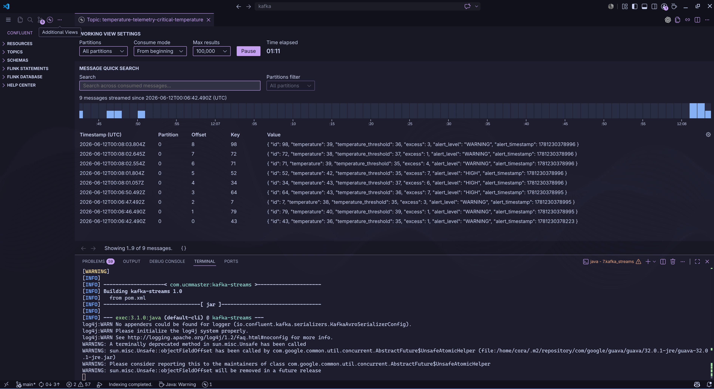

# Kafka Streams

El objetivo es practicar los principales conceptos que hemos visto en la teoría.

## Setup

Para practicar los siguientes ejercicios será necesario ejecutar la aplicación **ProducerAvroApp** que vimos durante la primera semana.
Esta aplicación producía eventos en el topic **temperature-telemetry**

```bash
# Primero creamos el topic para evitar que se cree con auto.create.topics.enable=true
docker exec -it broker-1 kafka-topics --bootstrap-server broker-1:29092 --create --topic temperature-telemetry --partitions 3 --replication-factor 2

mvn exec:java -Dexec.mainClass=com.ucmmaster.kafka.avro.ProducerAvroApp
```


## KStreamApp - [ejemplo](https://github.com/confluentinc/tutorials/blob/master/filtering/kstreams/src/main/java/io/confluent/developer/FilterEvents.java)

```bash
mvn exec:java -Dexec.mainClass=com.ucmmaster.kafka.streams.KStreamApp
```

El primer ejercicio consta de una aplicación Kafka Streams que filtra las lecturas cuya temperatura sea >= 30 grados.

Esta operación es sin estado (stateless) y por lo tanto nos basta con hacer un filtrado.

El stream resultante de este filtro producirá eventos en el topic **temperature-telemetry-high-temperature**

Revisa el código de la aplicación para entender los pasos.

Ejecuta la aplicación y observa el topic resultante.

## KTableApp - [ejemplo](https://github.com/confluentinc/tutorials/blob/master/schedule-ktable-ttl/kstreams/src/main/java/io/confluent/developer/KTableTTL.java)

El segundo ejercicio consta de una aplicación Kafka Streams que filtra las lecturas cuya temperatura sea < 30 grados.

Esta operación es sin estado (stateless) y por lo tanto nos basta con hacer un filtrado.

En este caso haremos uso de una KTable en vez de un stream, por lo que acumularemos por dispositivo el último valor cuya temperatura es menor a 30º.

El stream resultante de este filtro producirá eventos en el topic **temperature-telemetry-low-temperature**

Revisa el código de la aplicación para entender los pasos.

Ejecuta la aplicación y observa el topic resultante.

## KStreamAggApp

El tercer ejercicio consta de una aplicación Kafka Streams que agrega la máxima temperatura por dispositivo cada minuto.

Esta operación requiere estado (stateful) y por lo tanto nos basta con hacer un filtrado.

Los pasos para llevar a cabo la agregación son:

1. Agrupar usando la clave (la key de los registros es el id de dispositivo)
2. Establecer la ventana de tiempo de 1 minuto
3. Aplicar la función de agregación, en este caso la función max.
4. Transformar la KTable resultante en un KStream (Las operaciones stateful siempre devuelven un KTable)
5. Escribir el KStream en el topic final

El stream resultante de este filtro producirá eventos en el topic **temperature-telemetry-max-temperature**

Revisa el código de la aplicación para entender los pasos.

Ejecuta la aplicación y observa el topic resultante.

## KStreamJoinApp

En este caso vamos a cruzar dos streams: temperature-telemetry y devices.

Para simular el maestro de dispositivos haremos uso de un conector.

No olvides ejecuta el siguiente comando dentro del directorio 1.environment para instalar los conector plugins.

```bash
./install-connect-plugins.sh
```
Dentro del directorio 7.kafka_streams ejecuta los siguientes comandos para copiar lo schemas dentro del contenedor connect.

```bash
docker cp src/main/avro/*Device.avsc connect:/home/appuser/
docker cp src/main/avro/*Telemetry.avsc connect:/home/appuser/
```
Lanzamos el conector de devices:

```bash
curl -s -d @"./connectors/source-datagen-devices.json" -H "Content-Type: application/json" -X POST http://localhost:8083/connectors | jq
```

No te alarmes si aparece en rojo o detenido. El motivo es que una vez publica 100 registros se detiene.

El siguiente caso es opcional si ya tiene ejecutando el productor java utilizado en los ejercicios anteriores.

```bash
curl -s -d @"./connectors/source-datagen-temperature-telemetry.json" -H "Content-Type: application/json" -X POST http://localhost:8083/connectors | jq
```

Ejecuta la aplicación y observa el topic resultante.

