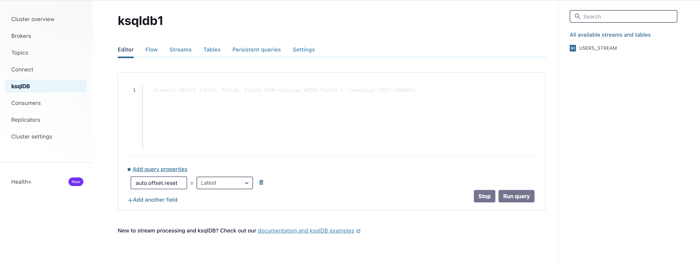
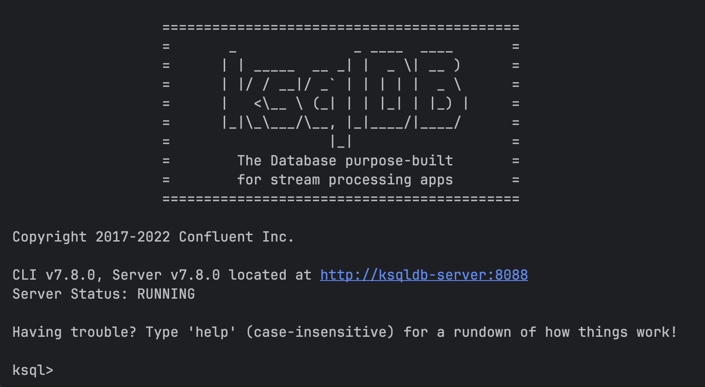

# KSQLDB

Existen dos maneras de interactuar con KSQLDB.

La manera más cómoda de acceder es a través de la UI de `Control Center`

[KSQLDB UI](http://localhost:9021/clusters/Nk018hRAQFytWskYqtQduw/ksql/ksqldb1/editor)



La otra, es a través del cliente CLI al que podemos acceder por el contender que tenemos habilitado para ello

```bash
docker exec -it ksqldb-cli /bin/bash
```

```bash
ksql http://ksqldb-server:8088
```



Ejecuta la siguiente sentencia SET para garantizar que todas nuestras consultas lean desde el primer offset en cada uno de los topics subyacentes:

```sql
SET 'auto.offset.reset' = 'earliest';
```

## Ejercicio 1

Lo siguiente que haremos es algunas operaciones básicas, como crear un stream desde nuestro topic `users` que contiene los datos generados por `DataGenSourceConnector`

```bash
curl -s -d @"../6.connect/connectors/source-datagen-users.json" -H "Content-Type: application/json" -X POST http://localhost:8083/connectors | jq
```

Para ello ejecutamos la siguiente query:

```sql
CREATE STREAM USERS_STREAM
WITH (
KAFKA_TOPIC='users',
KEY_FORMAT='KAFKA',
VALUE_FORMAT='AVRO');
```

Con esto hemos convertido nuestro topic en un `stream` sobre el que podremos operar.
Resaltar que no hemos tenido que indicar el schema ya que lo infiere del schema registry.

podemos ver los streams creados en nuestro server con:

```bash
ksql> show streams;

 Stream Name         | Kafka Topic                 | Key Format | Value Format | Windowed
------------------------------------------------------------------------------------------
 USERS_STREAM        | users                       | KAFKA      | AVRO         | false
------------------------------------------------------------------------------------------
```

Para observar la topología detrás de nuestro stream podemos ejecutar:

```bash
DESCRIBE USERS_STREAM EXTENDED;
```

```bash
Name                 : USERS_STREAM
Type                 : STREAM
Timestamp field      : Not set - using <ROWTIME>
Key format           : KAFKA
Value format         : AVRO
Kafka topic          : users (partitions: 1, replication: 1)
Statement            : CREATE STREAM USERS_STREAM (REGISTERTIME BIGINT, USERID STRING, REGIONID STRING, GENDER STRING) WITH (CLEANUP_POLICY='delete', KAFKA_TOPIC='users', KEY_FORMAT='KAFKA', VALUE_FORMAT='AVRO');

 Field        | Type
--------------------------------
 REGISTERTIME | BIGINT
 USERID       | VARCHAR(STRING)
 REGIONID     | VARCHAR(STRING)
 GENDER       | VARCHAR(STRING)
--------------------------------

Local runtime statistics
------------------------

(Statistics of the local KSQL server interaction with the Kafka topic users)
```

y ver los datos que llegan el:

```bash
SELECT * FROM USERS_STREAM EMIT CHANGES;
```
```bash
---------------------------------------+---------------------------------------+---------------------------------------+---------------------------------------+
|REGISTERTIME                           |USERID                                 |REGIONID                               |GENDER                                 |
+---------------------------------------+---------------------------------------+---------------------------------------+---------------------------------------+
|1498877767160                          |User_5                                 |Region_7                               |OTHER                                  |
|1501687894137                          |User_7                                 |Region_3                               |FEMALE                                 |
|1494927078699                          |User_1                                 |Region_7                               |OTHER                                  |
|1508971927264                          |User_8                                 |Region_4                               |FEMALE                                 |
|1507653694889                          |User_2                                 |Region_5                               |OTHER                                  |
|1510168418976                          |User_6                                 |Region_1                               |FEMALE                                 |
|1517244286768                          |User_7                                 |Region_8                               |MALE                                   |
|1504330433205                          |User_4                                 |Region_6                               |MALE                                   |
|1497472205228                          |User_1                                 |Region_7                               |FEMALE                                 |
|1490785132334                          |User_9                                 |Region_9                               |MALE                                   |
```
Al incluir EMIT CHANGES, estamos indicando a ksqlDB que ejecute una query, la cual emitirá automáticamente los cambios al cliente (en este caso, la CLI) siempre que haya nuevos datos disponibles.

Podemos usar limit para mostrar solamente el número de registros deseado

```bash
SELECT * FROM USERS_STREAM WHERE USERID = 'User_9' LIMIT 10;
```

Aplicaremos alguna transformación sobre este stream generando uno nuevo. Esto es lo que llamamos `Materialized Views`

Crearemos un nuevo stream, en el que solo tendremos `REGISTERTIME` y `USERID`:

```sql
CREATE STREAM USERS_REGISTRATION AS
  SELECT USERID, FROM_UNIXTIME(REGISTERTIME) AS REGISTERED_AT
  FROM USERS_STREAM;
```

```bash
ksql> show streams;

 Stream Name        | Kafka Topic        | Key Format | Value Format | Windowed
--------------------------------------------------------------------------------
 USERS_REGISTRATION | USERS_REGISTRATION | KAFKA      | AVRO         | false
 USERS_STREAM       | users              | KAFKA      | AVRO         | false
--------------------------------------------------------------------------------
```

Ahora podemos visualizar en tiempo real los registros del un usuario

```bash
SELECT * FROM USERS_REGISTRATION WHERE `USERID` = 'User_9' EMIT CHANGES;
```

```bash
+---------------+----------------------------------+
|USERID         |REGISTERED_AT                     |
+---------------+----------------------------------+
|User_9         |2017-08-18T20:20:09.203           |
|User_9         |2017-07-18T23:01:29.551           |
|User_9         |2017-06-15T08:18:46.535           |
|User_9         |2017-09-23T11:20:40.664           |
|User_9         |2018-02-10T03:23:39.464           |
...
```
Creamos una tabla que contará los usuarios que se registran agrupando por USERID:

```sql
CREATE TABLE USERS_REGISTRATIONS_COUNT AS
  SELECT `USERID`, count(*) as count
  FROM USERS_REGISTRATION
  GROUP BY `USERID`;
```
```sql
SELECT * FROM USERS_REGISTRATIONS_COUNT;
```

Contaremos los registros de cada usuario por minuto:

```bash
CREATE TABLE USERS_REGISTRATIONS_PER_MINUTE as
SELECT `USERID`, COUNT(*) as count FROM USERS_STREAM
  WINDOW TUMBLING (SIZE 1 MINUTE)
  GROUP BY `USERID`;
```

Agregamos el numero de conexiones del usuario con nuestro Stream base:

```bash
CREATE STREAM USERS_AGG AS
  SELECT
    l.userid AS userid,
    l.registertime AS registertime,
    r.count AS total_registrations
  FROM USERS_STREAM l
  JOIN USER_REGISTRATIONS_COUNT r
    ON l.userid = r.userid
  EMIT CHANGES;
```

En caso de error al crearlo para borrar: `DROP STREAM USERS_AGG DELETE TOPIC;`


```bash
show topics;
```
```bash
show tables;
```
## Ejercicio 2

Creating Connectors with ksqlDB

```bash
CREATE { SOURCE | SINK } CONNECTOR [ IF NOT EXISTS ] <identifier> WITH( property_name = expression [, ...]);
```
```bash
CREATE SOURCE CONNECTOR SOURCE_DATAGEN_USERS_KSQL WITH (
  'connector.class'                          = 'io.confluent.kafka.connect.datagen.DatagenConnector',
  'kafka.topic'                              = 'users',
  'quickstart'                               = 'users',
  'max.interval'                             = '1000',
  'iterations'                               = '10000000',
  'tasks.max'                                = '1',
  'value.converter'                          = 'io.confluent.connect.avro.AvroConverter',
  'value.converter.schema.registry.url'      = 'http://schema-registry:8081',
  'value.converter.schemas.enable'           = 'false',
  'topic.creation.default.replication.factor' = '3',
  'topic.creation.default.partitions'        = '3'
);
```
```bash
 Message
---------------------------------------------
 Created connector SOURCE_DATAGEN_USERS_KSQL
---------------------------------------------
```

```bash
SHOW CONNECTORS;
```
```bash
Connector Name               | Type   | Class                                               | Status
---------------------------------------------------------------------------------------------------------------------------
 SOURCE_DATAGEN_USERS_KSQL    | SOURCE | io.confluent.kafka.connect.datagen.DatagenConnector | RUNNING (1/1 tasks RUNNING)
```

```sql
DESCRIBE CONNECTOR `SOURCE_DATAGEN_USERS_KSQL` ;
```
```bash

Name                 : SOURCE_DATAGEN_USERS_KSQL
Class                : io.confluent.kafka.connect.datagen.DatagenConnector
Type                 : source
State                : RUNNING
WorkerId             : connect:8083

 Task ID | State   | Error Trace
---------------------------------
 0       | RUNNING |
---------------------------------
```

```sql
DROP CONNECTOR [ IF EXISTS ] <identifier>
```

```sql
DROP CONNECTOR SOURCE_DATAGEN_USERS_KSQL;
```
```bash
 Message
-----------------------------------------------
 Dropped connector "SOURCE_DATAGEN_USERS_KSQL"
-----------------------------------------------
```

La sentencia PRINT en ksqlDB sirve para inspeccionar el contenido de un Kafka topic de forma directa y en tiempo real
No requiere que exista un STREAM o TABLE previamente definido sobre el topic.

```sql
PRINT 'nombre-del-topic' [FROM BEGINNING] [LIMIT n];
```

1. Lectura desde el principio del topic (la más utilizada)

```sql
PRINT users FROM BEGINNING;
```
2. Limitar el número de mensajes mostrados

```sql
PRINT users FROM BEGINNING LIMIT 10;
```
3. Lectura desde el final (solo nuevos mensajes)

```sql
PRINT users;
```

## Ejercicio 3

Los streams y las tablas constituyen las dos abstracciones principales en el núcleo tanto de Kafka Streams como de ksqlDB. En ksqlDB, se denominan collections.

Las tablas pueden considerarse como una foto de un conjunto de datos que se actualiza de forma continua, en la que se almacena el estado más reciente o el resultado del cálculo (en el caso de una agregación) de cada clave única presente en un topic dentro de la collection subyacente.
Están respaldadas por topics compactados y aprovechan los state stores de Kafka Streams.
Un caso de uso muy habitual para las tablas es el enriquecimiento de datos basado en cruces (join-based data enrichment), en el que una tabla lookup puede consultarse para aportar contexto adicional sobre los eventos que llegan a través de un stream.
Las tablas también desempeñan un papel especial en las agregaciones.

Las streams, por su parte, se modelan como una secuencia inmutable de eventos. A diferencia de las tablas, que poseen características mutables, cada evento en un stream se considera independiente de todos los demás.
Las streams son stateless, lo que significa que cada evento se consume, se procesa y, posteriormente, se olvida.
Para visualizar la diferencia, veamos la siguiente secuencia de eventos (las claves y valores se muestran como <clave, valor>):

**Secuencia de eventos**
```text
<K1, V1>
<K1, V2>
<K1, V3>
<K2, V1>
```

Un stream modela el historial completo de eventos, mientras que una table captura el estado más reciente de cada clave única. Las representaciones como stream y como table de la secuencia anterior se muestran a continuación:

**Stream**

```text
<K1, V1>
<K1, V2>
<K1, V3>
<K2, V1>
```
**Table**

```text
<K1, V3>
<K2, V1>
```
Existen varias formas de crear streams y tables en ksqlDB. Pueden crearse directamente sobre Kafka topics

```sql
CREATE [ OR REPLACE ] { STREAM | TABLE } [ IF NOT EXISTS ] <identifier> (
    column_name data_type [, ... ]
) WITH (
    property=value [, ... ]
)
```

```sql
CREATE TABLE titles (
    id INT PRIMARY KEY,
    title VARCHAR
) WITH (
    KAFKA_TOPIC='titles',
    VALUE_FORMAT='AVRO',
    PARTITIONS=4
);
```
La cláusula PRIMARY KEY especifica la columna clave para esta tabla, y dicha clave se deriva de la record key.
Recordad que las tables poseen **semántica mutable** (de tipo actualización), de modo que si se reciben múltiples registros con la misma primary key, únicamente se almacenará el más reciente en la tabla.
La excepción a esta regla se produce cuando el record key está definida pero el valor es NULL. En tal caso, el registro se considera un tombstone y provocará la eliminación de la clave asociada.
Cabe destacar que, en el caso de las tablas, ksqlDB ignorará cualquier registro cuya key sea NULL (comportamiento que no se aplica a las streams).
Dado que estamos especificando la propiedad PARTITIONS en la cláusula WITH, ksqlDB creará automáticamente el topic si aún no existe (en este caso, el topic se creará con cuatro particiones).
También es posible establecer el factor de replicación del topic subyacente mediante la propiedad REPLICAS.

```sql
CREATE STREAM production_changes (
    rowkey VARCHAR KEY,
    uuid INT,
    title_id INT,
    change_type VARCHAR,
    created_at VARCHAR
) WITH (
    KAFKA_TOPIC='production_changes',
    PARTITIONS='4',
    VALUE_FORMAT='JSON',
    TIMESTAMP='created_at',
    TIMESTAMP_FORMAT='yyyy-MM-dd HH:mm:ss'
);
```
A diferencia de las tablas, los streams NO disponen de una columna primary key.
Los streams poseen una semántica **inmutable** (de tipo inserción), por lo que no es posible identificar de forma única los registros.
No obstante, el identificador KEY puede emplearse para asignar un alias a la columna que corresponde al record key (es decir, la clave del registro Kafka).
Esta configuración indica a ksqlDB que la columna created_at contiene el timestamp que debe utilizarse para las operaciones basadas en tiempo, incluidas las agregaciones windowed y las uniones.
La propiedad TIMESTAMP_FORMAT, que aparece en la línea siguiente, especifica el formato de los timestamps de los registros.

Las collections derivadas son el resultado de crear streams y tablas a partir de otros streams y tablas.
La sintaxis difiere ligeramente de la utilizada para crear otras colleciones, ya que no se especifican los esquemas de las columnas y se incorpora una cláusula adicional AS SELECT.
La sintaxis completa para la creación de colecciones derivadas es la siguiente:

```sql
CREATE { STREAM | TABLE } [ IF NOT EXISTS ] <identifier>
WITH (
    property=value [, ... ]
)
AS SELECT select_expr [, ...]
FROM from_item
[ LEFT JOIN join_collection ON join_criteria ]
[ WINDOW window_expression ]
[ WHERE condition ]
[ GROUP BY grouping_expression ]
[ PARTITION BY partitioning_expression ]
[ HAVING having_expression ]
EMIT CHANGES
[ LIMIT count ];
```

Las consultas utilizadas para crear colecciones derivados se denominan frecuentemente mediante uno de los dos acrónimos siguientes:

CSAS  — correspondiente a CREATE STREAM AS SELECT — se emplea para crear derived streams.

CTAS  — correspondiente a CREATE TABLE AS SELECT — se emplea para crear derived tables.

